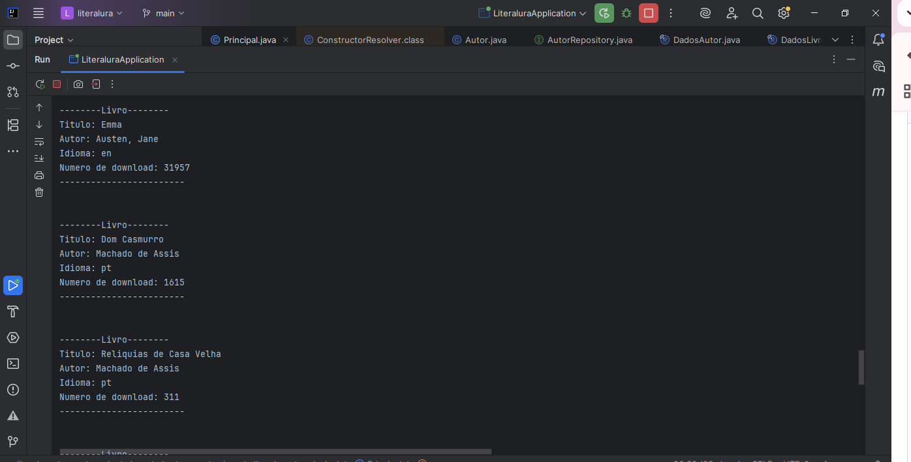
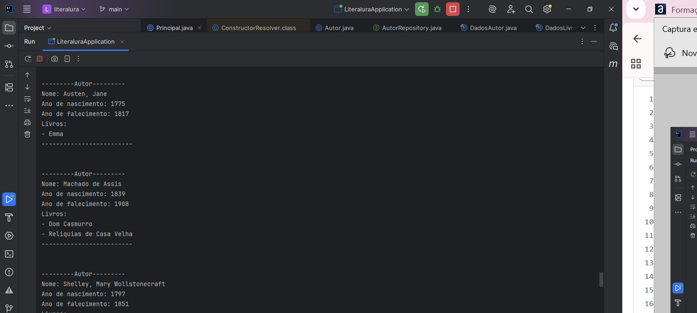
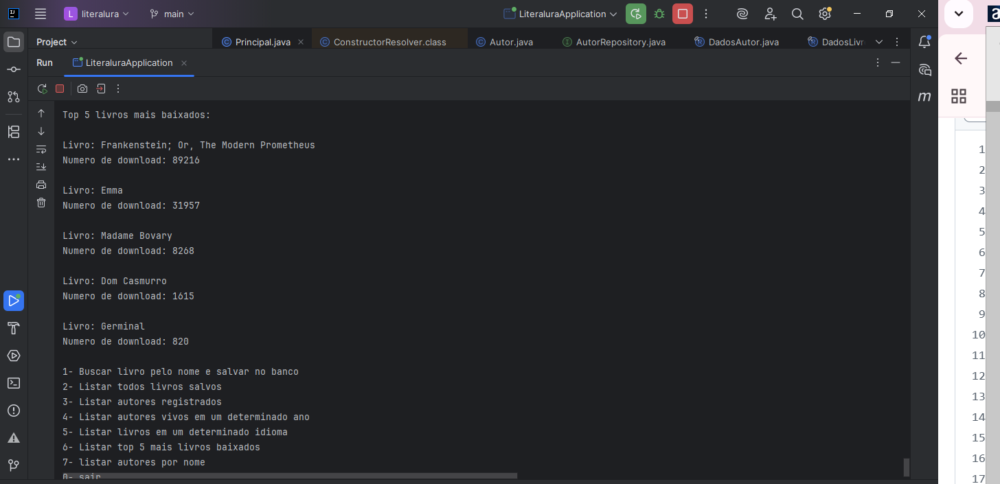

# 🔄 Challengea Literalura

Aplicação Java que utiliza uma API chamada <b>Gutendex</b>, uma API que retém dados de mais de 70 mil livros da biblioteca online e gratuita chamada Projeto Gutenberg, apresentando além do título e autores, dados como idiomas, formato do texto e quantidade de downloads.

**O intuito do projeto e colocar em prática tudo que foi ensinado até o momento do curso, que são:**
- Spring boot
- Arquitetura em camadas
- uso de records
- Anotações spring
- Stream
- Jpa repository

## ✨ Funcionalidades

- Buscar livro pelo nome e salvar no banco
- Listar todos livros salvos
- Listar autores salvos no banco
- Listar autores vivos em um determinado ano
- Listar livros em um determinado idioma
- Listar top 5 livros mais baixados
- listar autores por nome

## ⚙️ Tecnologias

- **Java 17**
- **GitHub**
- **Intellij**
- **Postgres**
- **Postman** para fazer alguns teste
- **Spring Boot**

## 🖥️ Exemplo de Execução
**Como e listados os livros:**

**Como e listados os autores:**

**Como e listado os livros mais baixados:**

## 👨🏻‍💻 Autor

- Bernardo Botelho

---

📅 Julho de 2025

